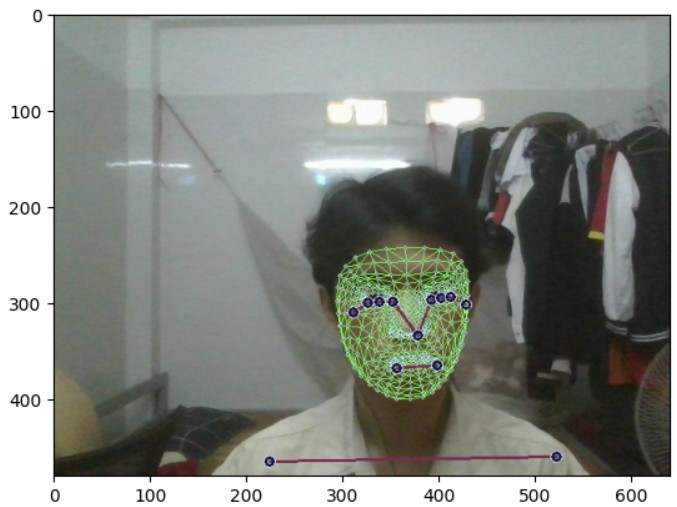
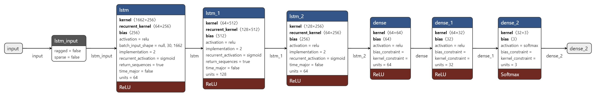
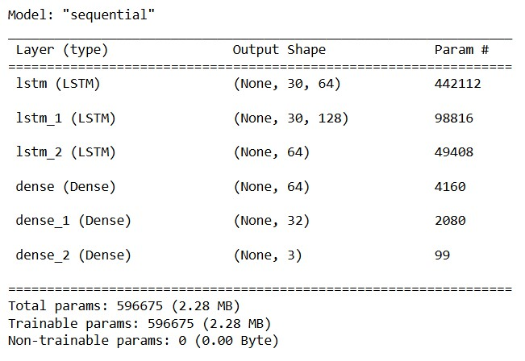
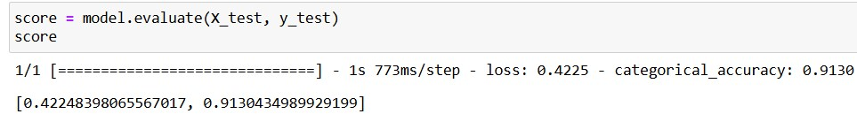

# LSTM-SignLanguageConversion
> Dự án  sử dụng **mạng nơ-ron dài ngắn hạn (LSTM)**  để nhận diện và chuyển đổi các cử chỉ ngôn ngữ ký hiệu thành văn bản có thể đọc được. Dự án này có thể ứng dụng trong các công cụ hỗ trợ giao tiếp cho người khiếm thị hoặc người có khó khăn trong việc giao tiếp bằng lời nói.
## Target
Mục tiêu của dự án là phát triển một hệ thống có thể nhận dạng các cử chỉ ngôn ngữ ký hiệu và chuyển chúng thành văn bản tương ứng. Điều này sẽ giúp tạo ra các công cụ hỗ trợ giao tiếp cho những người sử dụng ngôn ngữ ký hiệu trong cuộc sống hàng ngày.
## Tính năng
+ Nhận diện ngôn ngữ ký hiệu: Hệ thống có thể nhận diện các cử chỉ ngôn ngữ ký hiệu từ video hoặc hình ảnh.
+ Chuyển đổi thành văn bản: Các cử chỉ ngôn ngữ ký hiệu sẽ được chuyển đổi thành văn bản thông qua mô hình học sâu LSTM.
+ Ứng dụng trong giao tiếp hằng ngày: Dự án có thể sử dụng để hỗ trợ giao tiếp cho người khiếm thị hoặc những người giao tiếp bằng ngôn ngữ ký hiệu.
## Công nghệ
+ Ngôn ngữ lập trình: Python
+ Thư viện: TensorFlow / Keras, OpenCV, NumPy, Pandas, Matplotlib, scikit-learn,...
## Dữ liệu
Thay vì sử dụng dữ liệu mẫu thì chúng tôi thực hiện thu thập dữ liệu theo thời gian thực. Để nhận diện được các ký hiệu, chúng ta cần sử dụng webcam để nhận dữ liệu.

```cap = cv2.VideoCapture(0)```

```success, frame = cap.read()```

Do OpenCV mặc định sử dụng không gian màu BGR, trong khi MediaPipe thường yêu cầu RGB. Nên ta chuyển từ ảnh BGR sang ảnh RGB để dễ dàng xử lý. Sau đó ta sử dụng mô hình Holistic của MediaPipe để xử lý ảnh và trả về kết quả các đặc điểm được phát hiện trong hình ảnh

```def mediapipe_detection(image, model):```

  ```image = cv2.cvtColor(image, cv2.COLOR_BGR2RGB)```
  
  ```image.flags.writeable = False```
  
  ```results = model.process(image)```
  
  ```image.flags.writeable = True```
  
  ```image = cv2.cvtColor(image, cv2.COLOR_RGB2BGR)```
  
  ```return image, results```
  


## Kết quả
Cấu trúc mô hình:



Kết quả mô hình:



Accurancy:



## Tương lai phát triển
+ Cải thiện độ chính xác của mô hình đối với các ngữ cảnh ngôn ngữ ký hiệu phức tạp.
+ Xây dựng một giao diện người dùng dễ sử dụng để người dùng có thể tương tác trực tiếp với hệ thống chuyển đổi ngôn ngữ ký hiệu.

## Liên hệ
Nếu bạn có bất kỳ câu hỏi hoặc đóng góp nào về dự án, vui lòng liên hệ với chúng tôi qua email: quangh922@gmail.com.

## Giấy phép
Dự án này được phát hành dưới giấy phép **MIT License**.
